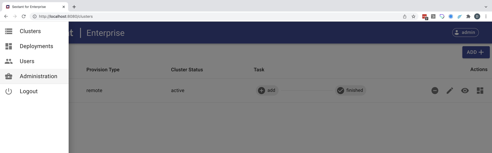
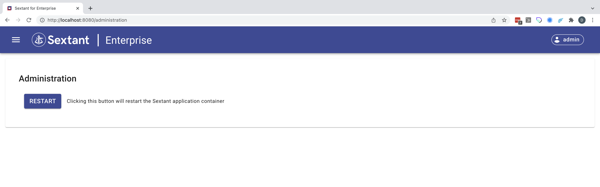

# Admin Operations

## Restart

Restarting Sextant may be done for several reasons, the most common of which is
to ensure that the helm charts that Sextant uses are the most current according
to its configuration.

### Step 1 - Select Administration

{ .shadow}

### Step 2 - Click on Restart Button

{ .shadow}

!!!Important
    Note that if you try to navigate to connect to or interact with Sextant
    while it is restarting you may have difficulty reconnecting or encounter
    errors while trying to navigate. These errors will resolve on their own once
    the restart is complete.
