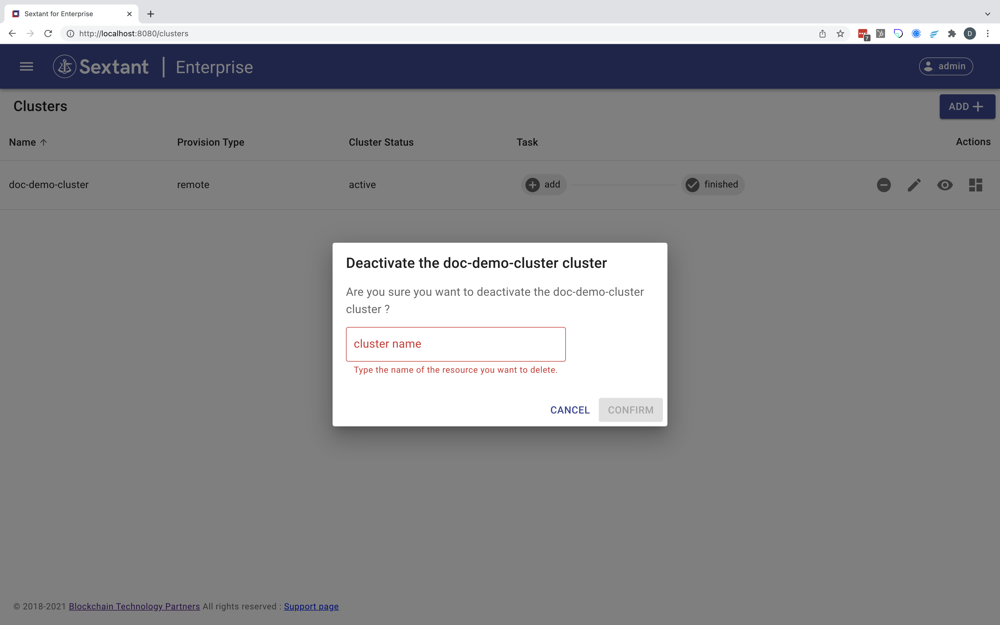
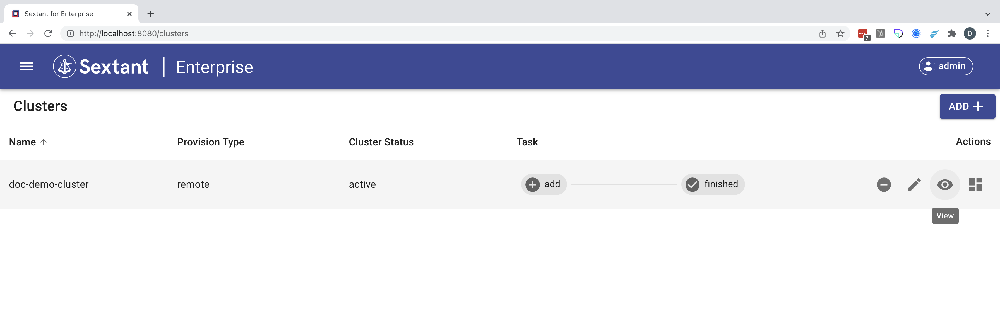

# Cluster Management

First select `Clusters`:

## Add a Cluster

### Step 1

On the `Clusters` page click on the `Add` button top right. This will take you
to the following screen:

### Step 2

Follow the instructions to download and run the `create-service.sh` script
making sure that your `kubectl` context is set to the correct target cluster.
Then run the `get-values.sh` script:

### Step 3

Complete the form chosing a meaningful name and copying the results of Step 2.
In this case we are using `doc-demo-cluster`:

### Step 4

Click the `Activate` button and you should see your cluster added to the list of
available target clusters:

## Interact with a Cluster

Once a cluster has been added to the list of target clusters you can interact
with it using the four icons on the right. These allow you to:

- [Deactivate a Cluster](#deactivate-a-cluster)
- [Edit a Cluster](#edit-a-cluster)
- [View a Cluster](#view-a-cluster)
- [View a Cluster's Deployments](#view-a-clusters-deployments)

### Deactivate a Cluster

Clicking the `Deactivate` button prompts you to confirm:

__NOTE__ that you won't be able to do this if there are deployments associated
with the target cluster you are trying to deactivate.

Complete this dialog with the correct cluster name:

Clicking `Confirm` completes the deactivation:

__NOTE__ that at this point the only options available to you are now `Delete`,
which has replaced `Deactivate`, and `Edit`.

#### Permanently Delete a Cluster

To permanently delete your cluster select `Delete`:

Then complete the dialog with the correct cluster name:

__WARNING__ Clicking `Confirm` deletes the cluster permanently.

#### Reactivate a Cluster

Alternatively you can select `Edit`:

This takes you to the `Edit` page for this cluster:

At this point you can reactivate the cluster simply by hitting `Save` button
without changing anything:

Return to [Interact with a Cluster](#interact-with-a-cluster).

### Edit a Cluster

Clicking the `Edit` button presents you with a form where you can, for example,
change the name of the cluster. Here we've changed it to `btp-demo-cluster` and
as a result it has been reactivated under this new name:

Return to [Interact with a Cluster](#interact-with-a-cluster).

### View a Cluster

Clicking the `View` button presents you with details of the cluster:

#### Add a Deployment (Shortcut)

This view also contains a shortcut that lets you `Add` a deployment without
going to the `Deployments` page:

__NOTE__ this effectively takes you straight to create a deployment
[Step 3](../deployments/management.md#step-3).

#### Audit Trail

However if you scroll down the `View` page for the cluster you can see the audit
trail of all tasks associated with it:

Return to [Interact with a Cluster](#interact-with-a-cluster).

### View a Cluster's Deployments

Clicking the `Deployments` button lists the deployments associated with this
cluster:

__NOTE__ this is effectively an alternative route to create a deployment
[Step 2](../deployments/management.md#step-2).

Return to [Interact with a Cluster](#interact-with-a-cluster).
