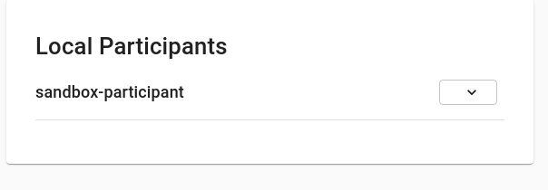
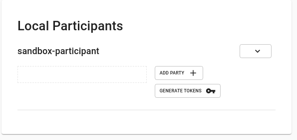
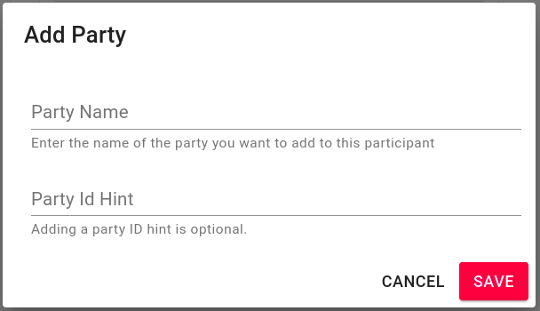
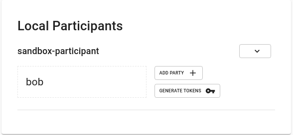
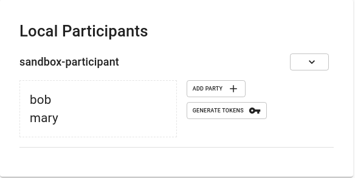
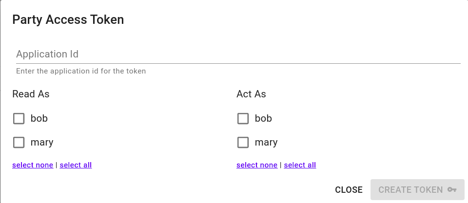
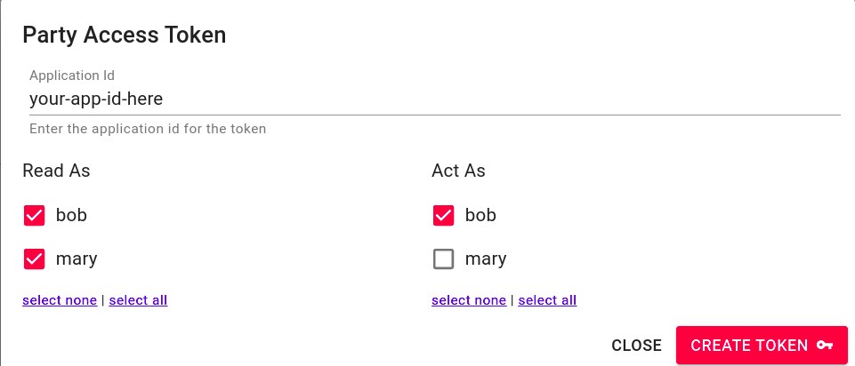
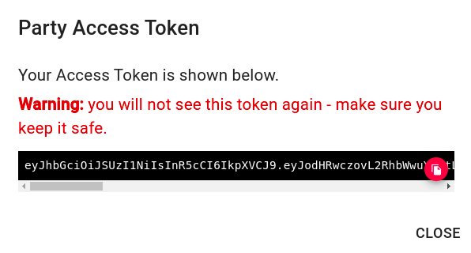
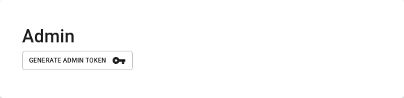

# Parties

At this time, it is required that Sextant be responsible for JWT token
generation in order to use Sextant to create and manage parties as well as
generate tokens.

## Getting to the Daml Parties screen

1. Open the sidebar using the icon at the top left of the Sextant screen

   

2. Click on the Deployments link which will bring you to the Deployments list

  

3. Find your deployment and click on the gear icon to the left of the deployment
   entry. This will bring you to the Daml Parties screen.

   

## Adding a party

To add a party to a daml ledger:

1. Find the "Local Participants" box

  

2. Click on the down arrow next to a participant to expand it

   

3. Click on the "Add Party" button which will bring up the add party-dialog

   

4. Enter the party name and a display hint for the party and click "Save". In a
   moment you should see your new party added to the particpant list, as well as
   the "All Parties" list.

   

  

## Creating a token

To create a token allowing access for one or more parties:

1. Find the "Local Participants" box

  

2. Click on the down arrow next to a participant to expand it

   

3. Click on "Generate Tokens" which will bring you to the "Party Access Token"
   dialog

   

4. Fill out the form and select the parties and privileges as desired and click
   "Create Token".

   

   This will bring you to the "Party Access Token" dialog. IMPORTANT! You must
   save the generated token somewhere appropriate.  It may not be recovered,
   but a new token with identical privileges may be created.

   

## Generating an Admin Access Token

1. Find the "Box" box

  

2. Click on the "Generate Admin Token" button. This will immediately generate
   a new admin token. IMPORTANT! You must
   save the generated token somewhere appropriate.  It may not be recovered,
   but a new token with identical privileges may be created.

   
