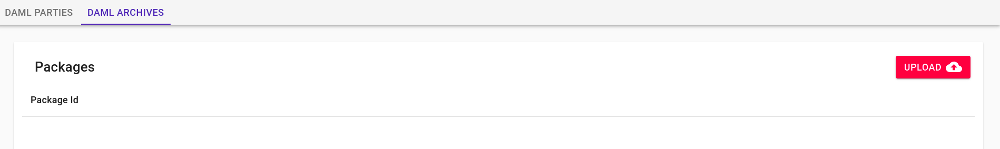
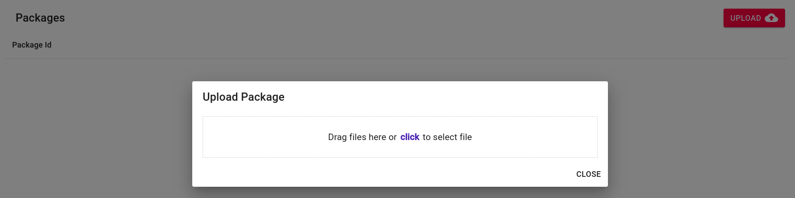
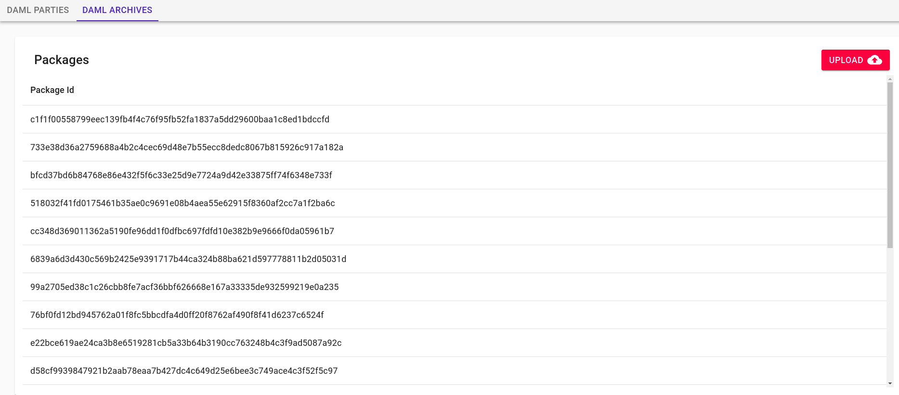

# Packages

  This page describes the Sextant functionality for dealing with Daml packages
  and archives, i.e. dars.

## Uploading a Packages

1. Select the "Daml Archives" tab.

   

1. Click the "Upload" button.

   

1. Click and select or drag a file on to the dialog. It will immediate begin
   uploading the file into the ledger. When it is complete it will return to the
   package listing, now with the new packages listed.

   
