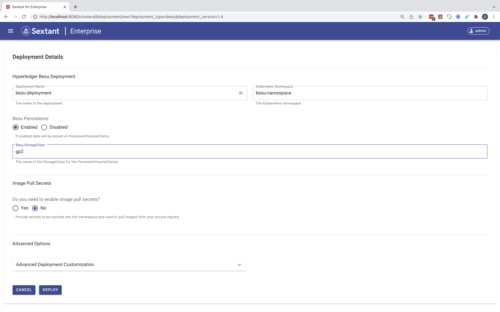
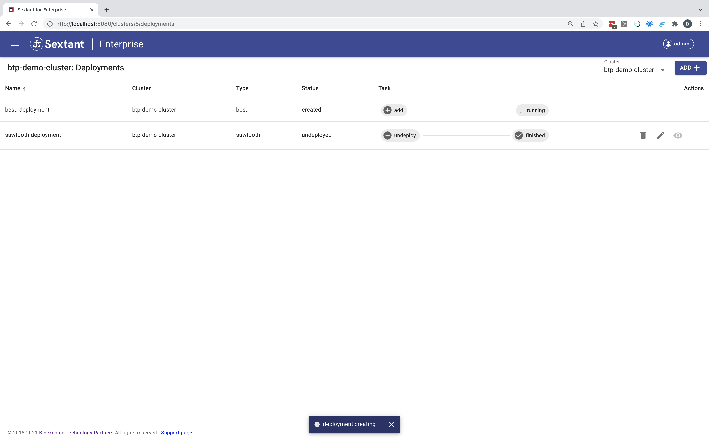
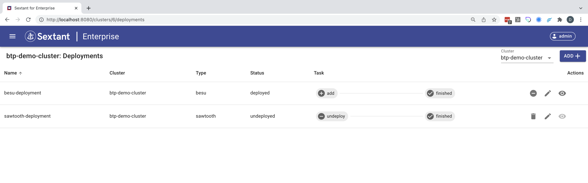

# Deploying Besu

Selecting `Hyperledger Besu` in the deployments dropdown menu takes you to
its deployment form. Here all you need to do is give your deployment a name,
specify its namespace and decide whether you want to enable persistence or not.
In this example we've opted to enable persistence and specified `gp2` as the
storage class as we are using AWS:

Click `Deploy` and the deployment will be created by Sextant:

Then added to the cluster:

Once you deployment has been added you can view interact with it as described
[here](../management.md#generic-interactions).

__NOTE__ deployment is not instantaneous as under the covers Sextant uses the
appropriate helm chart to create your deployment which can involve pulling the
appropriate images if these aren't already cached by the Kubernetes cluster.

## Besu Services

Once a `Hyperledger Besu` deployment is running it is possible to expose
various Besu features using Kubernetes services. This is covered in depth
[here](besu-services.md).

## Deployment Options

Beyond specifying whether you want to enable persistence for your Besu
deployment these are the options supported by Sextant.

### Image Pull Secrets

This option allows you to specify any image pull secrets that may be required in
order to access images related to your deployment that are hosted in a private
repository. These all need to be available in your target namespace.

### Advanced Options

#### Advanced Deployment Customization

This option provides advanced users with the ability to specify
_Additional YAML_ which will override default template options. We recommend
that you discuss any proposed customization with us first.
