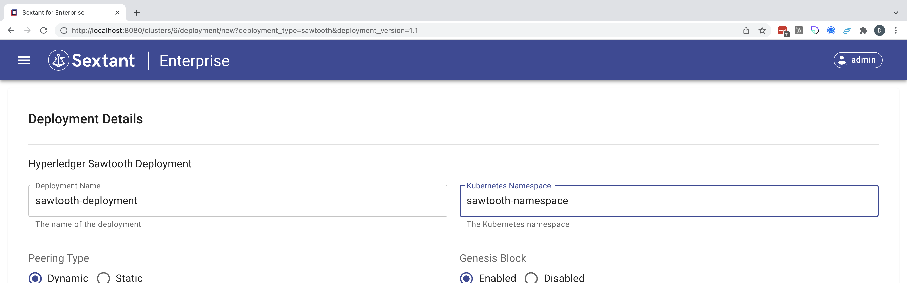
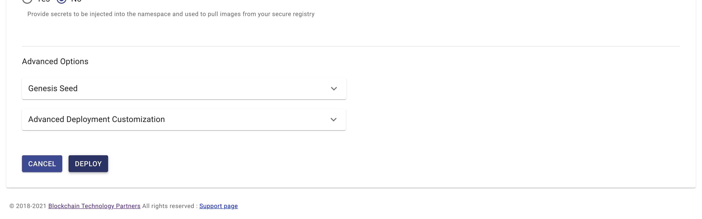
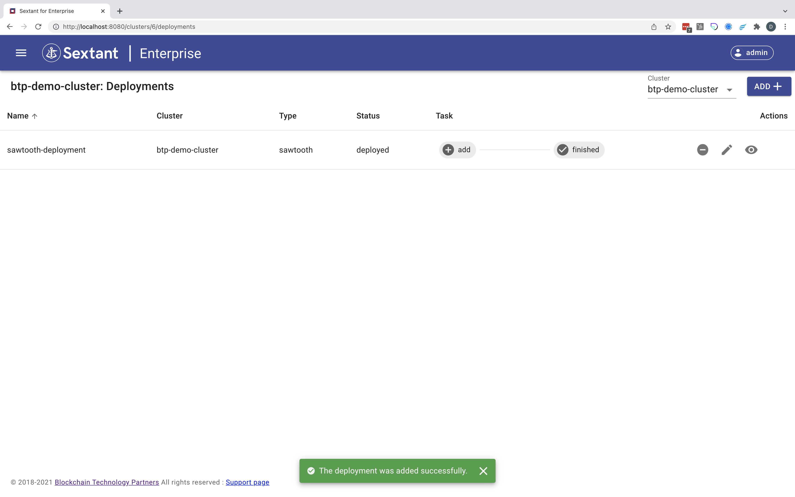
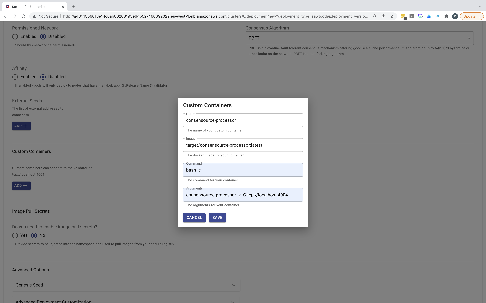

# Deploying Sawtooth

Selecting `Hyperledger Sawtooth` in the deployments marketplace takes you to
its deployment form. Here all you need to do is give your deployment a name
and specify its namespace:

{.shadow}

For a vanilla deployment accept the defaults and scroll to the bottom of the form:

{.shadow}

Click `Deploy` and the deployment will be created and added to the cluster:

{.shadow}

Once your deployment has been added, you can view and interact with it as described
[here](../management.md#generic-interactions).

!!!Warning
    Deployment is not instantaneous as under the covers Sextant uses the
    appropriate helm chart to create your deployment which may involve pulling
    the appropriate images if these aren't already cached by the Kubernetes
    cluster.

## Sawtooth Services

Once a `Hyperledger Sawtooth` deployment is running it is possible to expose
various Sawtooth features using Kubernetes services. This is covered in depth
[here](sawtooth-services.md).

## Deployment Options

Beyond configuring Sawtooth itself these are the deployment options supported by
Sextant.

### Custom Containers

This option allows you to specify, for example, a custom transaction processor.

This is a powerful feature that will ensure that your custom TP (or other
container) is deployed at each Sawtooth node. A useful smoke test is this
example from Target:

- name: consensource-processor
- image: target/consensource-processor:latest
- command: bash -c
- arguments: consensource-processor -v -C tcp://localhost:4004

{.shadow}

!!!Note
    You can add a custom TP to the your deployment initially. However, you can
    also edit an existing deployment and redeploy with this your custom TP
    added. In the case of the latter, you can either do this with a deployed
    Sawtooth network in which case your custom TP will be added as a rolling
    update or undeploy it first.

### Image Pull Secrets

This option allows you to specify any image pull secrets that may be required in
order to access images related to your deployment that are hosted in a private
repository. These all need to be available in your target namespace.

### Advanced Options

#### Genesis Seed

This option allows you to change the genesis seed on redeployment.

#### Advanced Deployment Customization

This option provides advanced users with the ability to specify
_Additional YAML_ which will override default template options. We recommend
that you discuss any proposed customization with us first.
