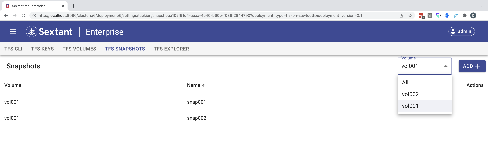

# TFS Admin

When you select `Settings` on your TFS on Sawtooth deployment you are presented
with this screen:

{ .shadow}

There are five tabs each of which is described in detail below.

## TFS CLI

This tab provides you with the docker command you can use to spin up a TFS
client that lets you interact with your deployment using the TFS CLI.

{ .shadow}

!!!Warning
  Note that the docker command only works correctly if you connect to Sextant
  via a load balancer otherwise the TFS_URL is malformed.

## TFS Keys

This tab lets you create TFS keys for use when creating encrypted TFS volumes:

{ .shadow}

!!!Important
  You need to save the key locally as this is generated by Sextant but not
  retained by it.

## TFS Volumes

This tab lets you create TFS volumes. Here we are creating `vol001` and
encrypting it using `key001`:

{ .shadow}

Having encrypted this volume we will need the key we saved earlier to read from
or write to it but it is now listed:

{ .shadow}

This tab also lets us interact with the volumes. We can either `View Snapshots`,
`Create a Snapshot` or `Edit` each volume using the three icons.

Clicking `Edit` lets you change the name of a volume:

{ .shadow}

Clicking `Create a Snapshot` switches the context to the `TFS Snapshots` pane
and let's you create a snapshot of your volume.

## TFS Snapshots

Here we are creating a second snapshot `snap002` for `vol001`:

{ .shadow}

Which now appears in the snapshot list:

{ .shadow}

## TFS Explorer

Before taking a closer look at the explorer lets run a TFS CLI session using
our docker command to spin up a tfs-client container:

```bash
user@c03b78df5774:/$ tfs-cli volume list
  VOLUME NAME               VOLUME UUID                COMPRESSION   ENCRYPTION
  vol002        caa56fc3-2206-4d52-8c7e-81b600bab5bf   NONE          NONE
  vol001        102f91d4-aeaa-4e40-b60b-f036f2844790   LZ4           AES_GCM
user@c03b78df5774:/$ ls /mnt/tfs
user@c03b78df5774:/$ tfs-fuse -v vol002 -m /mnt/tfs
user@c03b78df5774:/$ cd /mnt/tfs
user@c03b78df5774:/mnt/tfs$ ls
user@c03b78df5774:/mnt/tfs$ echo "hello world" > hello-world.txt
user@c03b78df5774:/mnt/tfs$ cat hello-world.txt
hello world
user@c03b78df5774:/mnt/tfs$ ls
hello-world.txt
user@c03b78df5774:/mnt/tfs$
```

The explorer lets you drilldown on individual volumes such as `vol002` and as
you can see this lists the file `hello-world.txt` created in that session:

{ .shadow}

At this point you can `Download`, `Open` or request `Info` on this file.
Opening it shows that the content mirrors the CLI session above:

{ .shadow}

Requesting its information provides you with the following readout:

{ .shadow}

Next we create (not shown) a snapshot `snap001` for `vol002` which is reflected
in the explorer:

{ .shadow}

Next we return to our TFS CLI session where we can lst the snapshot then
create a second file `descartes.txt`:

```bash
user@c03b78df5774:/mnt/tfs$ tfs-cli volume snapshot list vol002
  SNAPSHOT NAME
  snap001
user@c03b78df5774:/mnt/tfs$ echo "I think therefore I am" > descartes.txt
user@c03b78df5774:/mnt/tfs$ cat descartes.txt
I think therefore I am
user@c03b78df5774:/mnt/tfs$
user@c03b78df5774:/mnt/tfs$ ls
descartes.txt  hello-world.txt
```

Returning to the explorer and looking at `latest` we can see the new file:

{ .shadow}

!!!Note
  The snapshots are stored in a hidden readonly directory `.snapshots` as
  you can see if you switch back to the TFS CLI session:

```bash
user@c03b78df5774:/mnt/tfs$ ls -ltr
total 0
-rw-r--r-- 1 user user 12 Dec  7 21:44 hello-world.txt
-rw-r--r-- 1 user user 23 Dec  7 22:22 descartes.txt
user@c03b78df5774:/mnt/tfs$ ls -ltr .snapshots/
total 0
dr--r--r-- 1 root root 0 Dec  7 21:07 snap001
user@c03b78df5774:/mnt/tfs$ ls -ltr .snapshots/snap001/
total 0
-rw-r--r-- 1 user user 12 Dec  7 21:44 hello-world.txt
user@c03b78df5774:/mnt/tfs$
```

## Issues

__SXT-867__ TFS Explorer doesn't support encrypted volumes at present.
