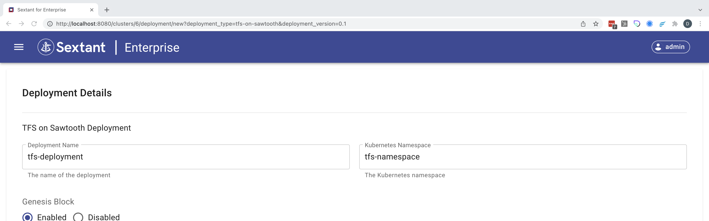
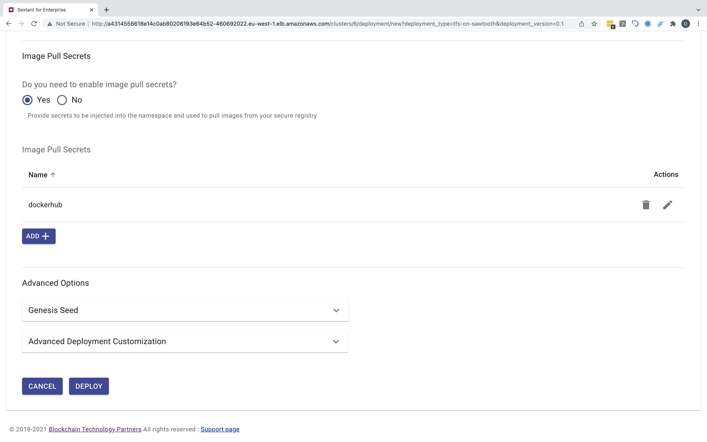
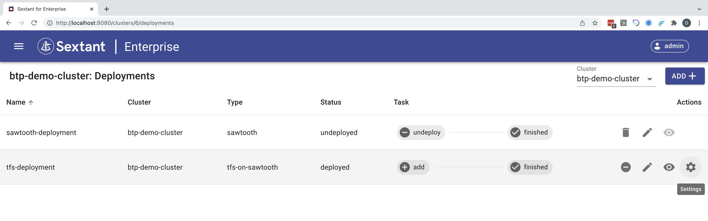

# Deploying TFS on Sawtooth

-----

__IMPORTANT__ `TFS on Sawtooth` is still in beta so you will need to be granted
access to the appropriate private docker hub repository.

Assuming you have been granted access using your docker hub credentials you will
need to create the target namespace for your deployment and create an image pull
secret in that namespace that you can reference later. In this example the
namespace is `tfs-namespace` and the image pull secret is `dockerhub`:

```bash
kubectl create namespace tfs-namespace
kubectl config set-context --current --namespace=tfs-namespace
kubectl create secret docker-registry dockerhub --docker-username=<username> \
--docker-password='<password>' --docker-email=<email>
```

-----

Selecting `TFS on Sawtooth` in the deployments dropdown menu takes you to
its deployment form. Here you need to give your deployment a name
and specify its namespace:



Then you need to scroll down, enable image pull secrets and add the image pull
secret you added to you created above:



Click `Deploy` and the deployment will be added to the cluster:



Note that this deployment includes a `Settings` option - the _gear_ icon - which
is covered [here](tfs-admin.md).

Once you deployment has been added you can view interact with it as described
[here](../management.md#generic-interactions).

__NOTE__ deployment is not instantaneous as under the covers Sextant uses the
appropriate helm chart to create your deployment which can involve pulling the
appropriate images if these aren't already cached by the Kubernetes cluster.

## Deployment Options

Beyond configuring Sawtooth itself these are the deployment options supported by
Sextant.

### Custom Containers

This option allows you to specify, for example, a custom transaction processor.

### Image Pull Secrets

This option allows you to specify any image pull secrets that may be required in
order to access images related to your deployment that are hosted in a private
repository. These all need to be available in your target namespace.

### Advanced Options

#### Genesis Seed

This option allows you to change the genesis seed on redeployment.

#### Advanced Deployment Customization

This option provides advanced users with the ability to specify
_Additional YAML_ which will override default template options. We recommend
that you discuss any proposed customization with us first.
