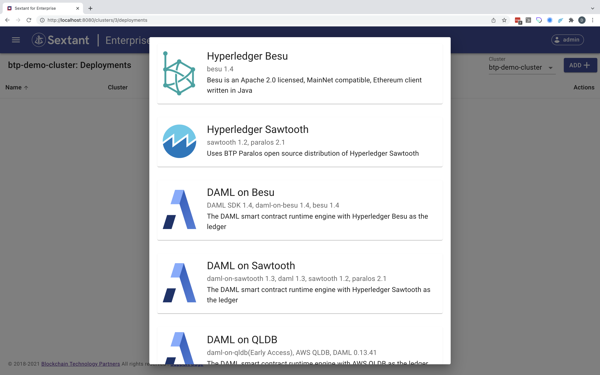

# Deployment Management

First select `Deployments`:

There are four basic management operations that apply to all deployments.

## Deploy

### Step 1

On the `Deployments` page select your target cluster in the top right drop down.

### Step 2

Click `Add`. This will create a dropdown menu from which you can select your
specific deployment.

### Step 3

Select your prefered deployment. The current _distributed ledger_ deployment
options are -

- [Hyperledger Sawtooth](dlts/sawtooth.md)
- [Hyperledger Besu](dlts/besu.md)

The current _smart contract_ deployment options are -

- [Daml on Sawtooth](smart-contracts/daml-on-sawtooth.md)
- [Daml on Besu](smart-contracts/daml-on-besu.md)
- [Daml on QLDB](smart-contracts/daml-on-qldb.md)
- [Daml on Postgres](smart-contracts/daml-on-postgres.md)

The current _information security_ options are -

- [TFS on Sawtooth](infosec/tfs-on-sawtooth.md)

## Edit

// TODO - Text and graphics here

## Undeploy

// TODO - Text and graphics here

## Delete

// TODO - Text and graphics here
