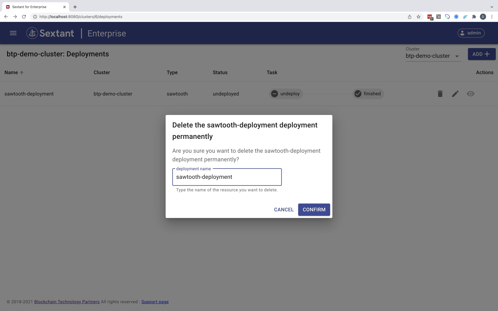

# Deployment Management

First select `Deployments`:

{ .shadow}

In addition to viewing all existing deployments managed by this instance of
Sextant or just those associated with a specific target cluster, there are four
basic management operations that apply to all deployments.

## Add a Deployment

### Step 1

On the `Deployments` page select your target cluster in the top-right drop down.

{ .shadow}

### Step 2

Click `Add`. This will take you to the deployments marketplace from which you
can select your specific deployment.

{.shadow}

### Step 3

Select your preferred deployment from the marketplace.

The current _distributed ledger_ deployment options are -

- [Hyperledger Besu](dlts/besu.md)

<!--

- [Hyperledger Fabric](dlts/fabric.md)

-->

- [Hyperledger Sawtooth](dlts/sawtooth.md)

The current _provenance_ options are -

- [Chronicle on Sawtooth](provo/chronicle-on-sawtooth.md)

The current _smart contract_ deployment options are -

- [Daml on Besu](smart-contracts/daml-on-besu.md)
- [Daml on Sawtooth](smart-contracts/daml-on-sawtooth.md)
- [Daml on QLDB](smart-contracts/daml-on-qldb.md)
- [Daml on Postgres](smart-contracts/daml-on-postgres.md)

<!--
The current _information security_ options are -

- [TFS™ on Sawtooth](infosec/tfs-on-sawtooth.md)

-->

In addition to these core deployments the marketplace includes some utility
deployments. These are documented [here](../topics/utility-deployments.md).

## Interact with a Deployment

Once a deployment has been successfully added to your target cluster you can
interact with it using the icons on the right.

- In all cases you can `Undeploy`, `Edit` and `View` a deployment. These
  generic interactions are covered in the next section.
- In the case of the Daml deployments there is also a fourth `Settings` option
  (in the form of a _gear_ icon) which lets you interact with the Daml ledger.
- In the case of the TFS™ on Sawtooth deployment there is also a fourth
  `Settings` option that lets you interact with the Taekion File System™.

## Generic Interactions

The three generic interactions are:

- [Undeploy a Deployment](#undeploy-a-deployment)
- [Edit a Deployment](#edit-a-deployment)
- [View a Deployment](#view-a-deployment)

These broadly follow the same pattern as before with cluster interactions.
We will use a plain vanilla Sawtooth deployment to illustrate each interaction.

### Undeploy a Deployment

{ .shadow}

Clicking the `Undeploy` button prompts you to confirm:

{ .shadow}

Complete this dialog with the correct deployment name:

{ .shadow}

Clicking `Confirm` completes the deactivation:

{ .shadow}

!!!Note
    At this point the only option available to you is now `Delete`, which has
    replaced `Undeploy`, and `Edit`.

#### Permanently Delete a Deployment

{ .shadow}

Clicking the `Delete` button prompts you to confirm:

{ .shadow}

Complete the dialog with the correct deployment name:

{ .shadow}

!!!Warning
    Clicking `Confirm` deletes the deployment permanently.

#### Redeploy a Deployment

Alternatively you can select `Edit`:

{ .shadow}

This takes you to the `Edit` page for this deployment:

{ .shadow}

At this point you can redeploy the deployment simply by scrolling down to the
bottom of the form then hitting the `Re-deploy` button:

{ .shadow}

!!!Note
    Alternatively you can edit the deployment first because unlike cluster
    management it is quite normal to cycle through undeploy-edit-redeploy
    especially if the change is significant and you are not in production.

When you hit `Re-deploy` Sextant saves the deployment:

{ .shadow}

Sextant then instructs Kubernetes to redeploy it and confirms when this is
finished:

{ .shadow}

Return to [Generic Interactions](#generic-interactions)

### Edit a Deployment

If you can select `Edit`:

{ .shadow}

This takes you to the `Edit` page for this deployment:

{ .shadow}

At this point you can make whatever modifications are appropriate to your
deployment, for example, in the case of a Sawtooth deployment this could be
adding or upgrading a custom transaction processor.

Once you have made your changes, scroll down to the bottom of the form then hit
the `Re-deploy` button:

{ .shadow}

As above Sextant will save your deployment then instruct Kubernetes to redeploy
it and confirms when this is finished:

{ .shadow}

!!!Important
    If you edit an active deployment it is important to understand that in
    the case of a distributed ledger deployment this will result in a rolling
    upgrade when you hit `Re-deploy` having edited your deployment.

Return to [Generic Interactions](#generic-interactions)

### View a Deployment

{ .shadow}

Clicking the `View` button presents you with details of the deployment which in
this case is a Sawtooth deployment:

{ .shadow}

!!!Note
    In this example you can interact with the Sawtooth network and delete
    individual pods:

{ .shadow}

The ability to delete an individual pod is a useful feature that comes in handy
from time to time, for example, if it is stuck.

#### Audit Trail

However if you scroll down the `View` page for the deployment you can see the
audit trail of all tasks associated with it:

{ .shadow}

Return to [Generic Interactions](#generic-interactions)
