# Daml Ledger Admin

When you select `Settings` by clicking on the _gear_ icon on any Daml deployment
you can interact with the Daml ledger via either the *Daml Archives* or the
*Daml Parties* tab.

## Daml Archives

A Daml Archive (Dar) file consists of one or more packages. Dar files can be
uploaded using this tab.

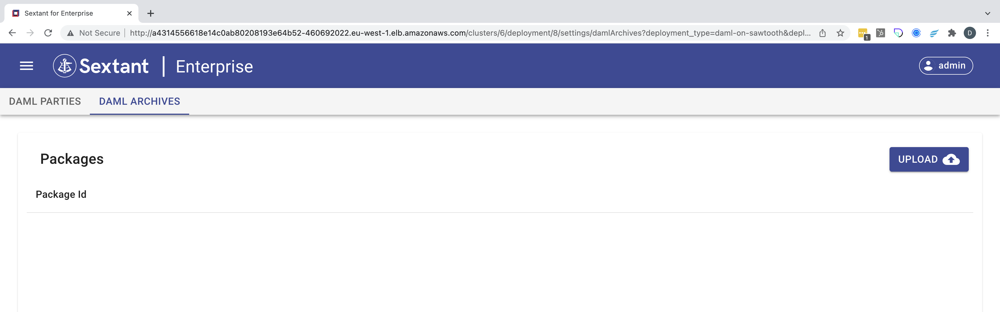

Click the `Upload` button.

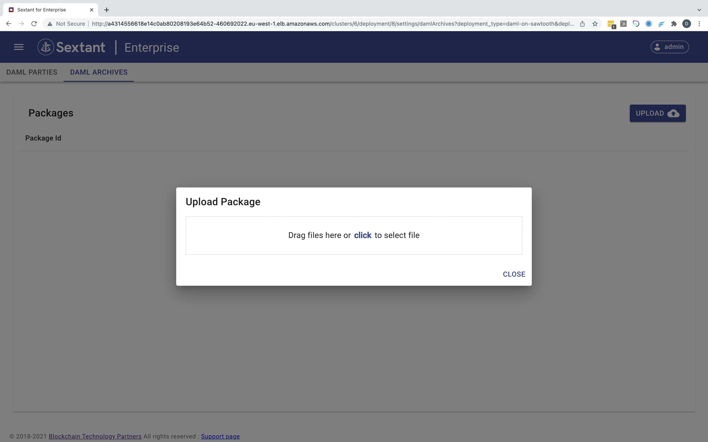

Click and select or drag a dar file onto the dialog. Sextant will immediately
begin uploading this dar file into the ledger:

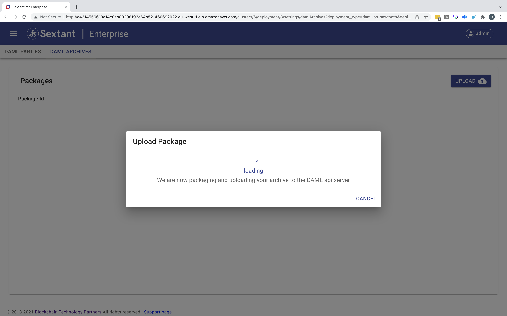

Once this process is complete it will return to the package listing, now with
the new packages listed.

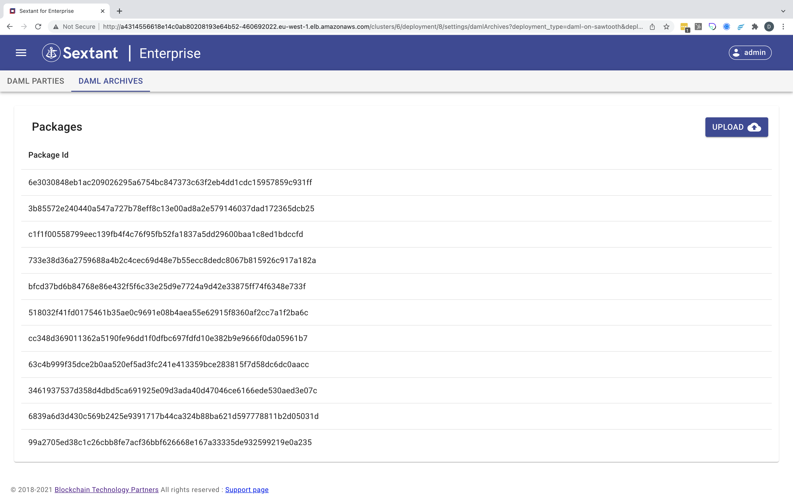

## Daml Parties

-----

__IMPORTANT__ At this time, it is required that Sextant be responsible for JWT
token generation in order to use Sextant to create and manage parties as well as
generate tokens.

-----

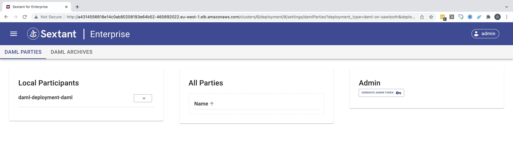

This tab supports three adminstrative functions:

### Adding a party

To add a party to a daml ledger:

1. Find the "Local Participants" box

   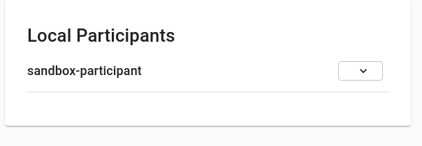

1. Click on the down arrow next to a participant to expand it

   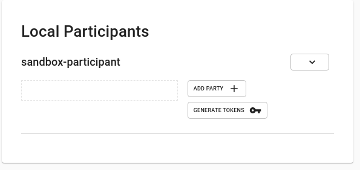

1. Click on the "Add Party" button which will bring up the add party-dialog

   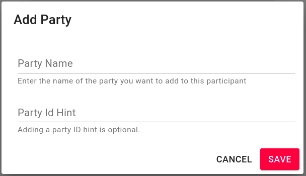

1. Enter the party name and a display hint for the party and click "Save". In a
   moment you should see your new party added to the particpant list, as well as
   the "All Parties" list.

   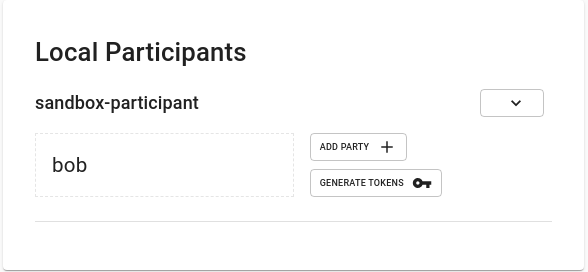

   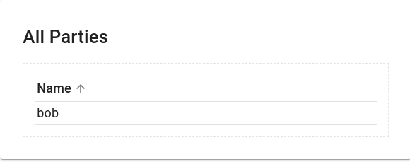

### Generating a Token

To generate a token allowing access for one or more parties:

1. Find the "Local Participants" box

   

1. Click on the down arrow next to a participant to expand it

   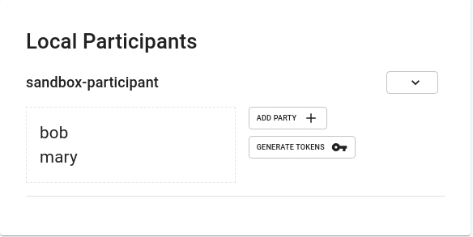

1. Click on "Generate Tokens" which will bring you to the "Party Access Token"
   dialog

   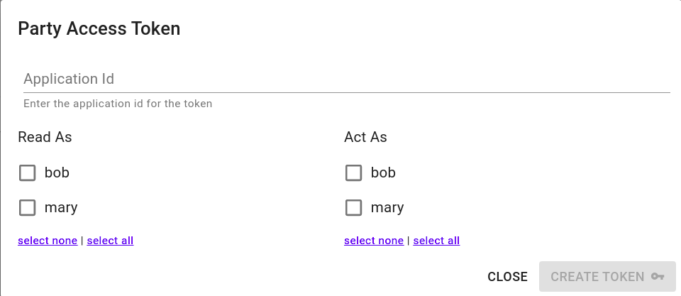

1. Fill out the form and select the parties and privileges as desired and click
   "Create Token".

   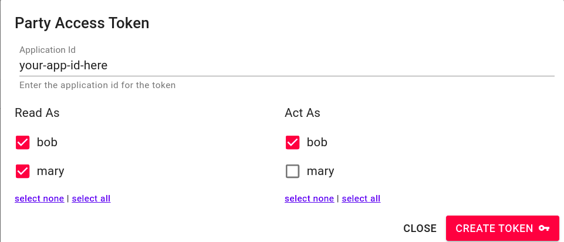

   This will bring you to the "Party Access Token" dialog. IMPORTANT! You must
   save the generated token somewhere appropriate.  It may not be recovered,
   but a new token with identical privileges may be created.

   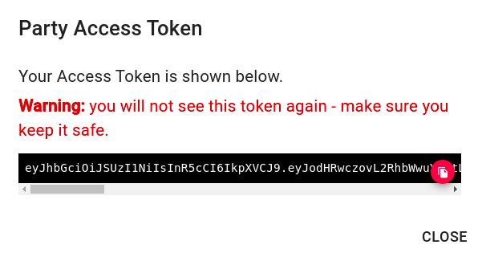

### Generating an Admin Access Token

1. Find the "Box" box

   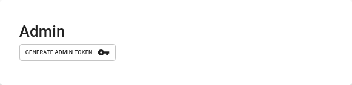

1. Click on the "Generate Admin Token" button. This will immediately generate
   a new admin token. IMPORTANT! You must
   save the generated token somewhere appropriate.  It may not be recovered,
   but a new token with identical privileges may be created.

   
