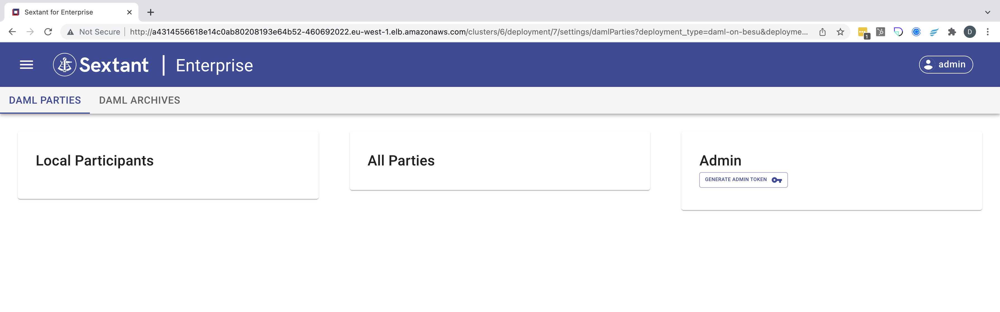

# Daml Ledger

When you select `Settings` on and Daml deployment you are presented with this
screen:

There are two tabs each of which is described in detail:

- [Daml Parties](daml-parties.md)
- [Daml Archives](daml-packages.md)
