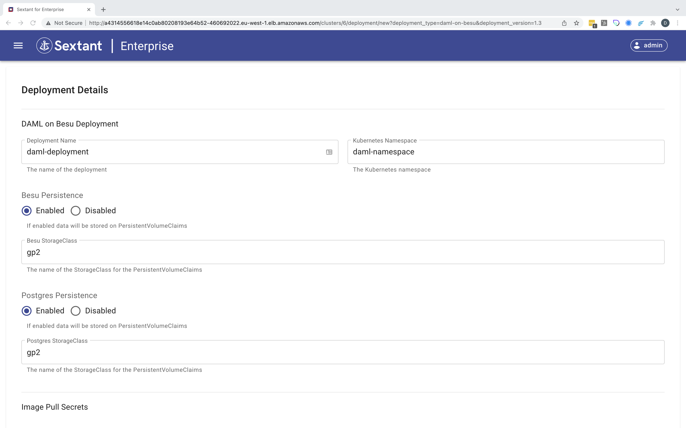
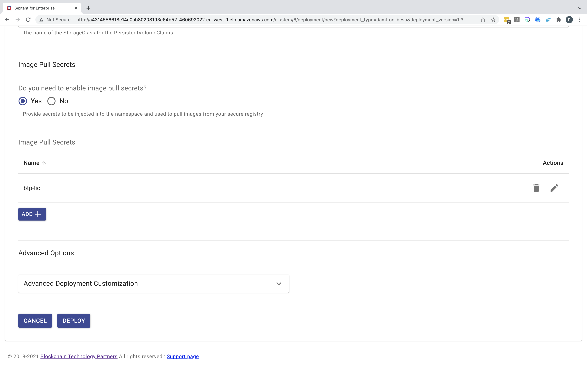
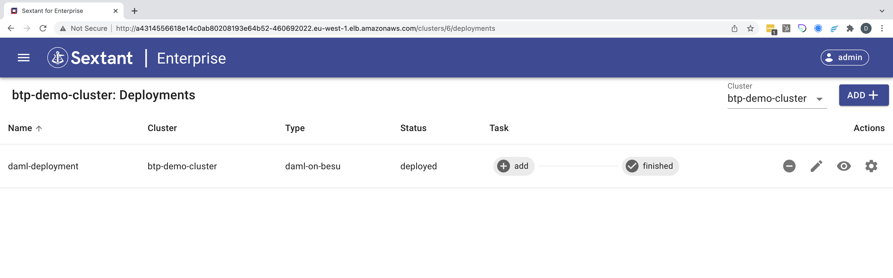

# Deploying Daml on Besu

-----

__IMPORTANT__ `Daml on Besu` cannot be deployed unless you have access to BTP's
official docker image registry. Once you have acquired the credentials for this
registry from BTP you will need to create the target namespace for your
deployment and create an image pull secret in that namespace that you can
reference later. In this example the namespace is `daml-namespace` and the image
pull secret is `btp-lic`:

```bash
kubectl create namespace daml-namespace
kubectl config set-context --current --namespace=daml-namespace
kubectl create secret docker-registry btp-lic \
--docker-server=https://dev.catenasys.com:8084/ --docker-username=<your-name> \
--docker-password='<your-password>' --docker-email=<your-email>
```

For more information on this command, see
[here](https://kubernetes.io/docs/tasks/configure-pod-container/pull-image-private-registry/#create-a-secret-by-providing-credentials-on-the-command-line)

-----

Selecting `Daml on Besu` in the deployments dropdown menu takes you to
its deployment form. Here you need to give your deployment a name, specify its
namespace using the one created above and decide whether you want to enable
persistence or not. In this example we've opted to enable persistence and
specified `gp2` as the storage class as we are using AWS:



Then you need to scroll down, enable image pull secrets and add the image pull
secret `btp-lic` you created above:



Click `Deploy` and the deployment will be created and added to the cluster:



Note that this deployment includes a `Settings` option - the _gear_ icon - which
is covered [here](daml-ledger-admin.md).

Once your deployment has been added you can view interact with it as described
[here](../management.md#generic-interactions).

__NOTE__ deployment is not instantaneous as under the covers Sextant uses the
appropriate helm chart to create your deployment which can involve pulling the
appropriate images if these aren't already cached by the Kubernetes cluster.

## Deployment Options

Beyond specifying whether you want to enable persistence for your deployment
these are the options supported by Sextant.

### Image Pull Secrets

This option allows you to specify any image pull secrets that may be required in
order to access images related to your deployment that are hosted in a private
repository. These all need to be available in your target namespace.

### Advanced Options

#### Advanced Deployment Customization

This option provides advanced users with the ability to specify
_Additional YAML_ which will override default template options. We recommend
that you discuss any proposed customization with us first.
