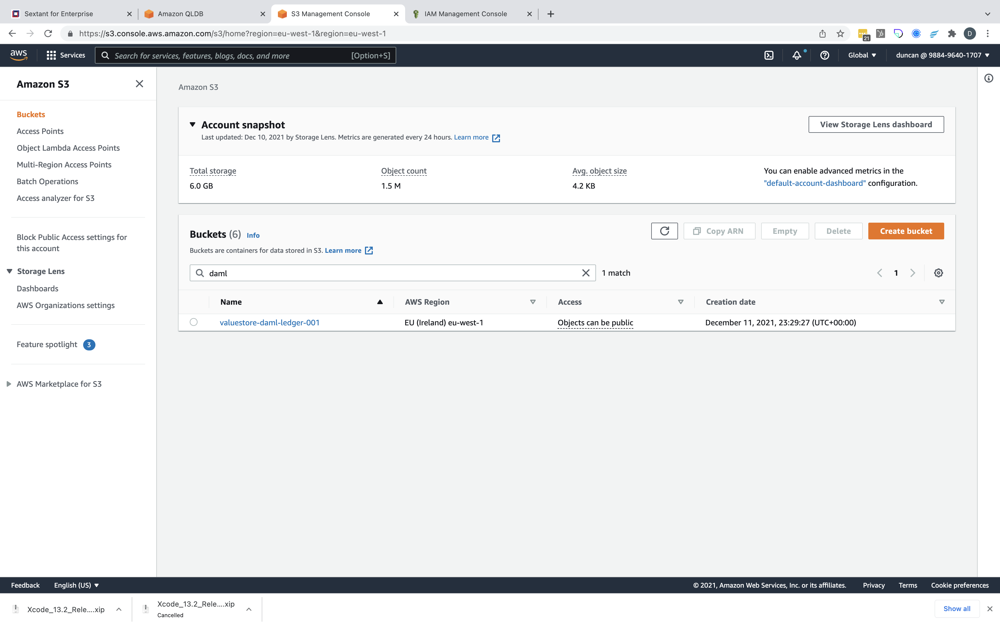

# Deploying Daml on QLDB

-----
__IMPORTANT__ before creating a Daml on QLDB deployment you will need to prepare
your target EKS Cluster by following the instructions
[here](../../../../cloud-providers/aws/eks-cluster-aws-services//).

Note that you only have to do this once and if you have already deployed
Daml on QLDB or Daml on Postgres (with AWS Aurora as the remote Postgres) using
your target cluster then this step will already have been completed.

-----

Selecting `Daml on QLDB` in the deployments marketplace takes you to
its deployment form. Here you need to give your deployment a name, specify its
namespace and provide a Daml Ledger ID.

!!!Note
    If the Daml Ledger ID refers to an existing QLDB Ledger then Sextant will
    use this otherwise it will create one.

In this example, we are not providing an existing QLDB Ledger as you can see
from our AWS Management Console:

{.shadow}

Instead we are expecting Sextant to create a new QLDB Ledger `daml-ledger-001`:

{.shadow}

Click `Deploy` and the deployment will be created and added to the cluster:

{.shadow}

Note that this deployment includes a `Settings` option - the _gear_ icon - which
is covered [here](daml-ledger-admin).

Once your deployment has been added you can view and interact with it as described
[here](../management#generic-interactions).

!!!Warning
    Deployment is not instantaneous as under the covers Sextant uses the
    appropriate helm chart to create your deployment which may involve pulling
    the appropriate images if these aren't already cached by the Kubernetes
    cluster.

In the case of a `Daml on QLDB` deployment it may also include the creation of
a QLDB Ledger as we can see here:

{.shadow}

Alongside the creation of the QLDB Ledger Sextant also creates an S3 bucket:

{.shadow}

__DANGER__ Neither the QLDB Ledger nor the S3 Bucket should be tampered with.

## Daml Services

Once a `Daml on QLDB` deployment is running it is possible to expose various
Daml features using Kubernetes services. This is covered in depth
[here](daml-services).

## Deployment Options

Beyond specifying whether you want to enable persistence for your deployment
these are the options supported by Sextant:

### Image Pull Secrets

This option allows you to specify any image pull secrets that may be required in
order to access images related to your deployment that are hosted in a private
repository. These all need to be available in your target namespace.

### Advanced Options

#### Advanced Deployment Customization

This option provides advanced users with the ability to specify
_Additional YAML_ which will override default template options. We recommend
that you discuss any proposed customization with us first.
