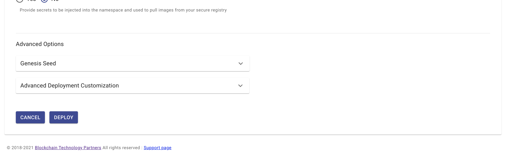
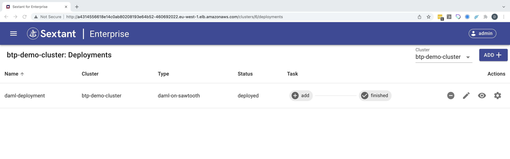

# Deploying Daml on Sawtooth

Selecting `Daml on Sawtooth` in the deployments dropdown menu takes you to
its deployment form. Here all you need to do is give your deployment a name
and specify its namespace:

{.shadow}

For a vanilla deployment accept the defaults and scroll to the bottom of the form:

{.shadow}

Click `Deploy` and the deployment will be created and added to the cluster:

{.shadow}

Note that this deployment includes a `Settings` option - the _gear_ icon - which
is covered [here](daml-ledger-admin.md).

Once your deployment has been added you can view interact with it as described
[here](../management.md#generic-interactions).

!!!Warning
    Deployment is not instantaneous as under the covers Sextant uses the
    appropriate helm chart to create your deployment which may involve pulling
    the appropriate images if these aren't already cached by the Kubernetes
    cluster.

## Sawtooth Services

Once a `Daml on Sawtooth` deployment is running it is possible to expose various
Sawtooth features using Kubernetes services. This is covered in depth
[here](../dlts/sawtooth-services.md).

## Daml Services

Once a `Daml on Sawtooth` deployment is running it is possible to expose various
Daml features using Kubernetes services. This is covered in depth
[here](daml-services.md).

## Deployment Options

Beyond configuring Sawtooth itself these are the deployment options supported by
Sextant.

### Custom Containers

This option allows you to specify, for example, a custom transaction processor.

### Image Pull Secrets

This option allows you to specify any image pull secrets that may be required in
order to access images related to your deployment that are hosted in a private
repository. These all need to be available in your target namespace.

### Advanced Options

#### Genesis Seed

This option allows you to change the genesis seed on redeployment.

#### Advanced Deployment Customization

This option provides advanced users with the ability to specify
_Additional YAML_ which will override default template options. We recommend
that you discuss any proposed customization with us first.
