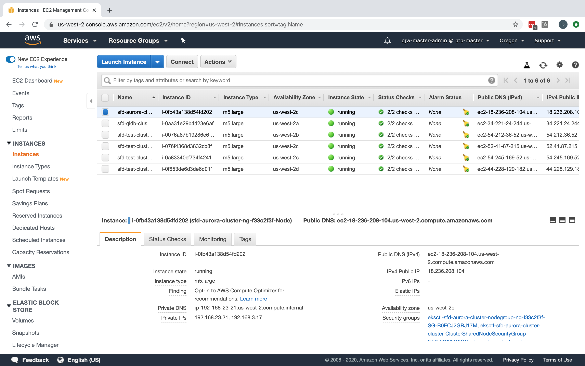
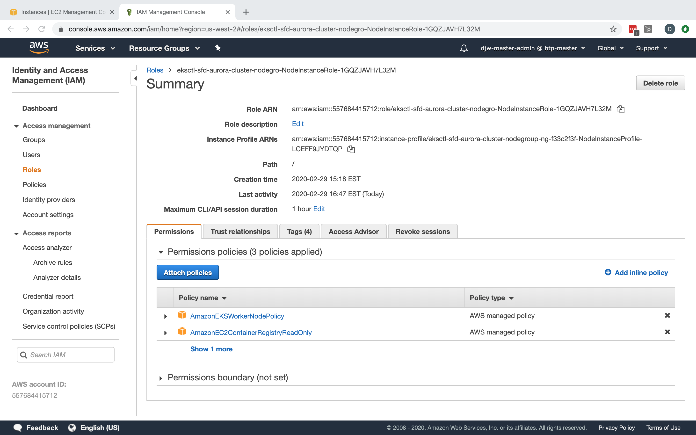
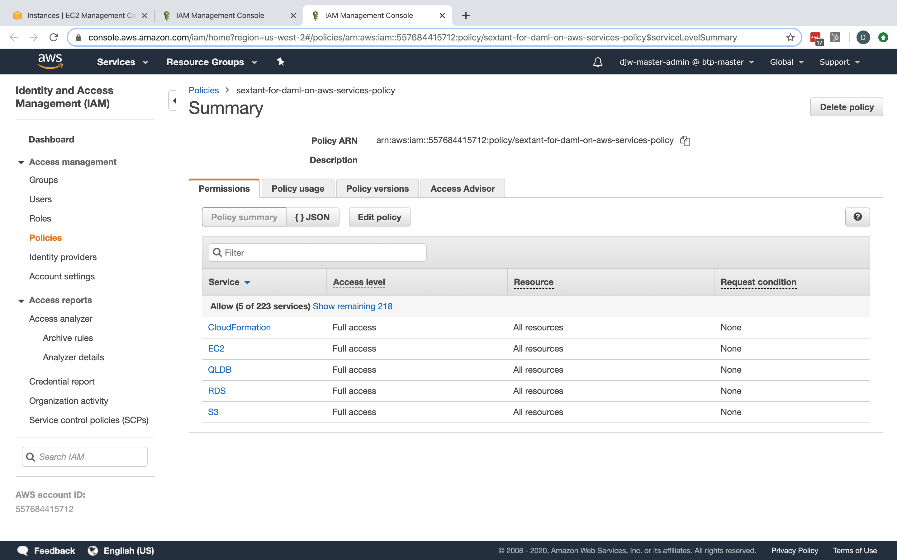

# Enabling Daml on QLDB

To enable Daml on Amazon QLDB Sextant needs to be able to create an Amazon QLDB
instance on demand. Likewise, to enable Daml on Amazon Aurora Sextant needs to
be able to create an Amazon Aurora database on demand if the user doesn't supply
one.

To support these features the target EKS cluster requires some additional
permissions added to the worker instance IAM Role. This document describes the
steps necessary to fulfill that requirement.

__NOTE__ These changes can be applied your EKS cluster before or after it is
added to Sextant in the usual way.

__NOTE__ These instructions focus on using the AWS Console. For information
about achieving the same result via the AWS CLI please contact us
via [Get Support](https:/blockchaintp.com/sextant/support/).

## Modify EKS Cluster permissions using the AWS Console

### Prerequisites

- Access to the AWS management console for your account
- AWS IAM permissions to create policies and attach them to IamInstanceProfiles
- A running EKS cluster and the AWS `instance-id` of a worker node in
  this cluster

### Procedure

1. Go the EC2 management console for the region your worker nodes are in, for
   example `us-west-2`
1. Go to the _Instances_ list
1. Find an instance of a worker node for your cluster in the list, and select
   it.  In the description there will be a field _IAM role_ whose value is the
   name of the IAM role we need to modify.  This value is also a live link so
   right click it to open new tab.
1. This will bring you to the page to edit the necessary IAM *NodeInstanceRole*.
1. Under the Permissions tab on this page is a button marked _Attach Policies_.
   Click this button.
1. You should now be looking at the _Attach Permissions_ page, on this page
   there is a button _Create policy_, right click that button and open the link
   in a new tab, we will come back to the _Attach Permissions_ page later in
   this procedure.
1. You should now see the _Create Policy_ screen. There are two tabs on this
   screen. One is marked *JSON*, select that tab.
1. In the editor paste the following JSON text:

```json
{
  "Version": "2012-10-17",
  "Statement": [
    {
      "Sid": "VisualEditor0",
      "Effect": "Allow",
      "Action": [
        "ec2:*",
        "cloudformation:*",
        "rds:*",
        "qldb:*",
        "s3:*"
      ],
      "Resource": "*"
    }
  ]
}
```

1. Click _Review policy_
1. On the _Review policy_ screen give the new policy a meaningful name such as
    `sextant-for-daml-on-aws-services-policy` then click _Create policy_
1. Now let's return to the _Attach Permissions_ page
1. Click the _refresh_ icon on the top right to refresh the policy list.
1. In the search box type the name of the policy we just created
1. You should now see your new policy in the list, select that policy and click
   the _Attach policy_ on the bottom right
1. Your worker instance role now has permissions to manage RDS instances and
   QLDB via CloudFormation

### Walkthrough

Here we are using the AWS Console approach outlined in these instructions and
adding the appropriate policy to node instance `i-0fb43a138d54fd202` in an EKS
cluster `sfd-aurora-cluster` in `us-west-2`.



First we open its _IAM_ role in a new tab.



Next we select _Attach Policies_ which takes us to the _Attach Permissions_
screen (not shown here). From there we click _Create Policy_ which takes us to
a dialog where we define our policy to enable the management of RDS instances
and QLDB via CloudFormation and give it
the name `sextant-for-daml-on-aws-services-policy`.



__NOTE__ this policy only needs to be created once in any given AWS account.

Returning to the _Attach Permissions_ screen, we search for our policy, select
it then click _Attach Policy_ to attach it to the instance to enable it to
manage RDS instances and QLDB via CloudFormation.


If this is successful you should get a confirmation.


