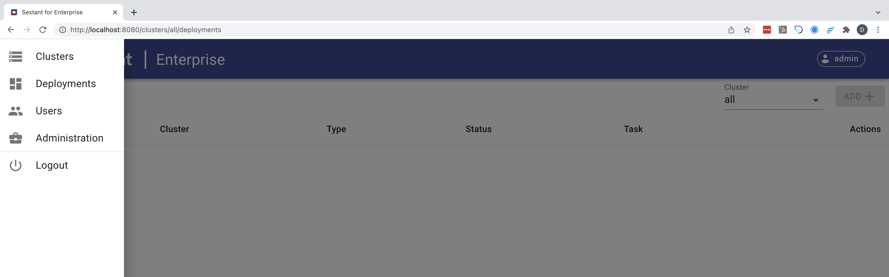

# Sextant for Enterprise

## Introduction

_Sextant for Enterprise_ delivers the fundamental building blocks for
multiparty innovation. It allows organizations to navigate distributed ledger,
smart contract, and information security infrastructure deployment and
management with ease.

## Overview

_Sextant for Enterprise_ focuses on three key areas:

### Distributed Ledgers

Sextant automates the deployment and management of enterprise blockchain
infrastructure, and currently supports the open-source Hyperledger Besu and
Hyperledger Sawtooth distributed ledgers.

### Smart Contracts

Sextant accelerates the adoption of Daml, an open-source smart contract language
and application framework, by simplifying the deployment and management of the
Daml runtime environment on distributed ledgers as well as centralized
alternatives.

### Information Security

Sextant simplifies the deployment and management of the Taekion File System as
well as its underlying distributed ledger, Hyperledger Sawtooth, delivering
military-grade protection for your business-critical information.

## Key Concepts

Once you have logged into Sextant you can use the dropdown menu to select one of
four options:

{ .shadow}

- [Manage Clusters](clusters/overview.md)
- [Manage Deployments](deployments/overview.md)
- [Manage Users](users/overview.md)
- [Administration](admin/overview.md)
