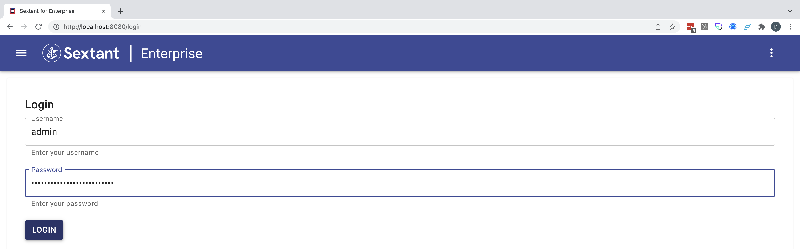

# Sextant Installation

!!!Note
    Sextant only needs to be installed on one of your clusters unless you
    are running multiple environments such as development, QA, staging and
    production.

## Enterprise Subscription

If you have subscribed to Sextant directly (or requested an evaluation) then the
instructions on how to install Sextant can be found
[here](enterprise.md).

## AWS Marketplace Subscriptions

If you have subscribed to Sextant via one of the AWS Marketplace editions then
select the instructions for your particular edition:

* [Sextant Enterprise Edition](aws-enterprise.md)
* [Sextant Premium Edition](aws-premium.md)
* [Sextant Standard Edition](aws-standard.md)

## Login to Sextant

Once you have installed Sextant then it is straight forward to login. For
example, using `port-forward` and the admin/password combination saved:

{ .shadow}
