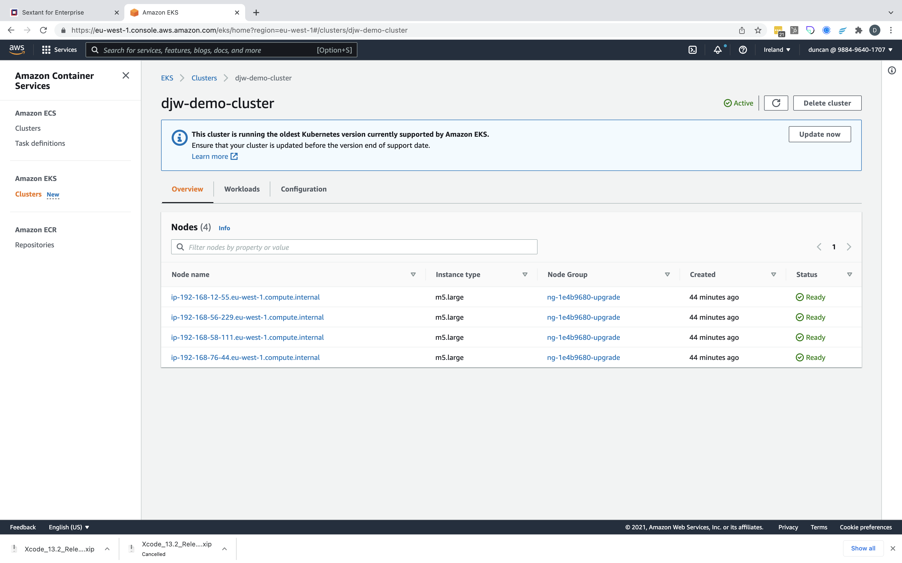
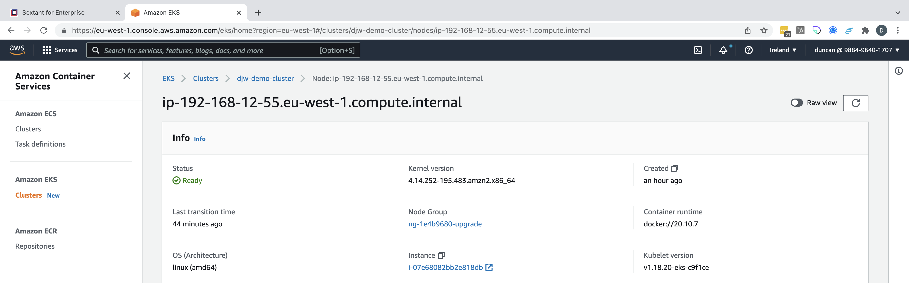
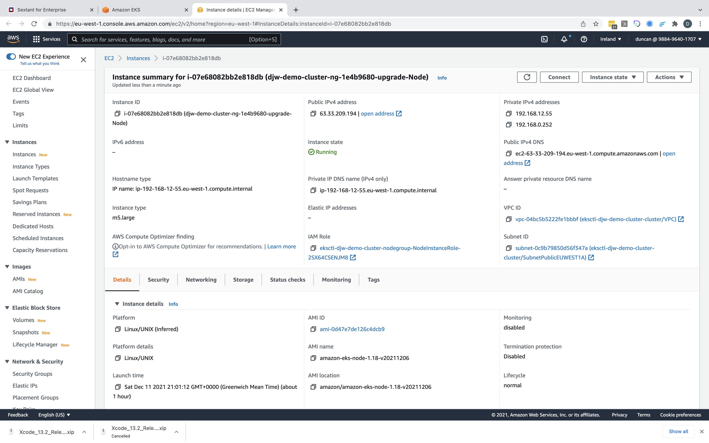
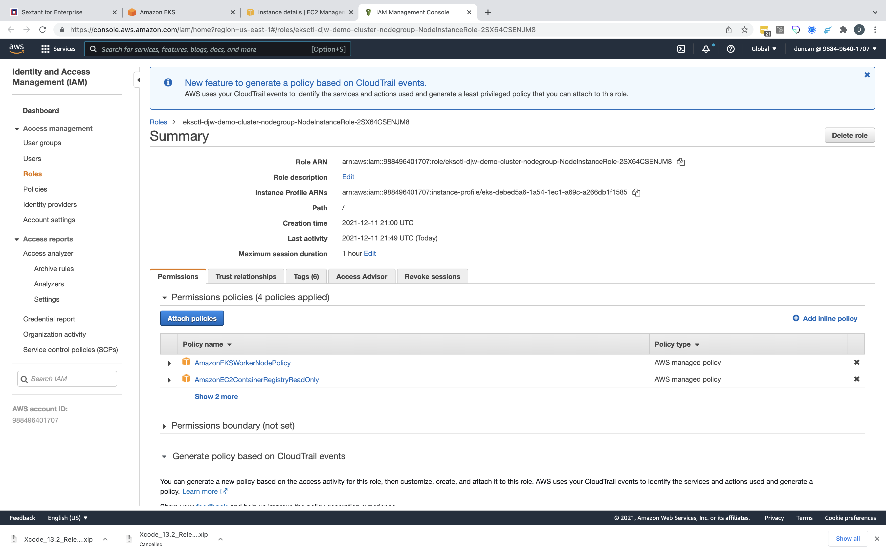
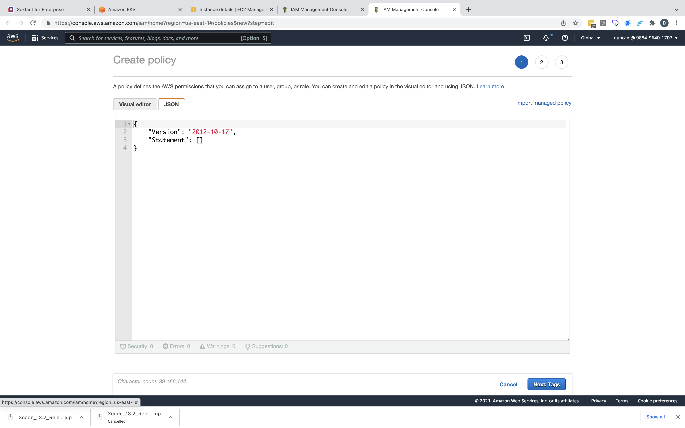
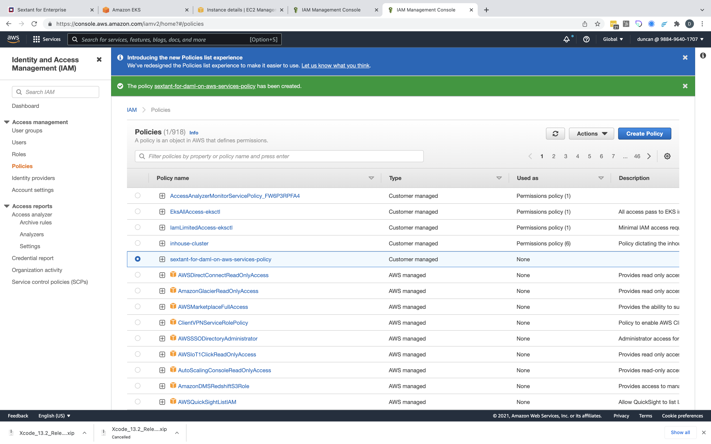
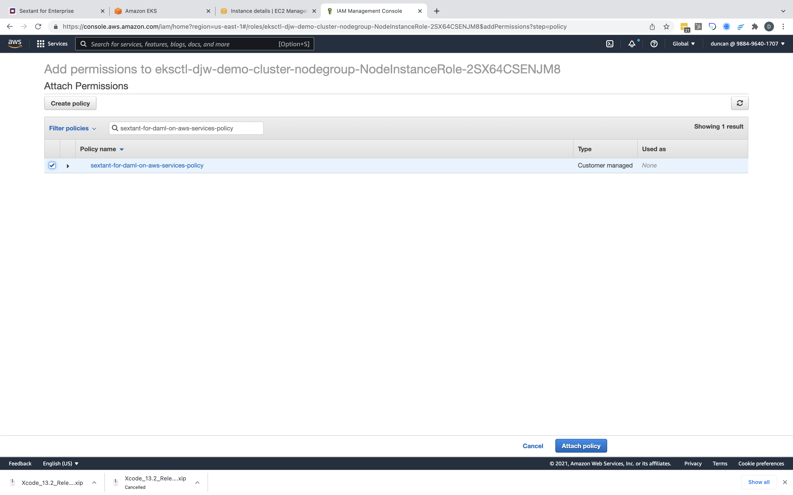
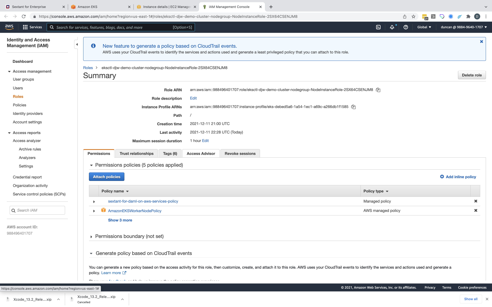

# Enabling Daml on QLDB

To enable Daml on Amazon QLDB Sextant needs to be able to create an Amazon QLDB
instance on demand.

To support this feature your target EKS cluster requires some additional
permissions added to the worker instance IAM Role. This document describes the
steps necessary to fulfill that requirement.

__NOTE__ These changes can be applied your EKS cluster before or after it is
added to Sextant in the usual way.

## Modify EKS Cluster permissions using the AWS Console

### Prerequisites

- Access to the AWS Management Console for your account
- Access with an AWS IAM role that lets you create policies and attach these to
  `IamInstanceProfiles`

### Procedure

Sign in to the AWS Management Console [here](https://console.aws.amazon.com)
using your credentials, setting the region to match your cluster. Then navigate
to the _Elastic Kubernetes Service_ and select your target EKS cluster from the
list:



Next select one of the worker nodes listed in the overview:



In its *Info* panel there is an _instance_ field which contains a link the
worker node's instance, in this case `i-07e68082bb2e818db`. Click on this link
to open a new browser tab with the instance details:



In its *Instance summmary* panel there is an _IAM Role_ field. This is a link
to the IAM role we need to modify. Click on this link to open a new browser tab
which will let you edit this *NodeInstanceRole*:



Select the *Permissions* tab if required then click `Attach Policies` button.
You should now be looking at the *Attach Permissions* page. Click the
`Create policy` to open a new browser tab and select _JSON_ tab:



Replace the stub policy by pasting the following JSON text:

```json
{
  "Version": "2012-10-17",
  "Statement": [
    {
      "Sid": "VisualEditor0",
      "Effect": "Allow",
      "Action": [
        "ec2:*",
        "cloudformation:*",
        "rds:*",
        "qldb:*",
        "s3:*"
      ],
      "Resource": "*"
    }
  ]
}
```

Click `Next: Tags` button then `Next: Review policy` buttonwhich takes you to
the *Review Policy* page. Now give the new policy a meaningful name such as
`sextant-for-daml-on-aws-services-policy` then click `Create policy`:


Click `Create policy` and you should see this confirmed:



Close this browser tab and you should return to the previous browser tab
labelled *IAM Management Console*. __REFRESH__ this browser tab then use
the search function to filter for your new policy and select this:



Finally click `Attach Policy` to add your new policy to the IAM role for your
worker instance which now has permissions to manage RDS, S3 and QLDB via
CloudFormation.

### Confirmation

To confirm that this policy has been attached first close the
*IAM Management Console* browser tab. This should take you back to the
*Instance Details* browser tab where, as before, there is an _IAM Role_ field.
Click on this link to open a new *IAM Management Console* displaying the IAM
role and this time you should see the new policy listed:


