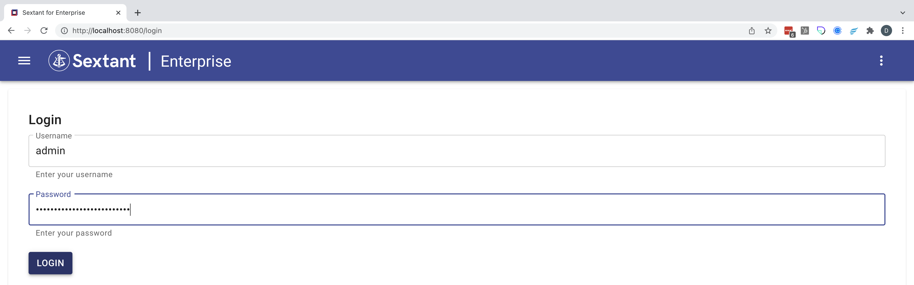

# Sextant Installation

## Enterprise Subscription

If you have subscribed to Sextant directly (or requested an evaluation) then the
instructions to install Sextant can be found
[here](https://docs.blockchaintp.com/projects/btp-helm-charts/en/latest/sextant-enterprise/installing/).

## AWS Marketplace Subscription

If you have subscribed to Sextant via the AWS Marketplace then you need to
install Sextant on an EKS cluster that has the correct permissions.

### Step 1

Prepare your EKS Cluster by following the instructions
[here](/docs/topics/eks-cluster-aws-marketplace.md)

### Step 2

// TODO - Text here

## Login to Sextant

Once you have installed Sextant then it is straight forward to login. For
example, using `port-forward` and the admin/password combination saved:

{ .shadow}
