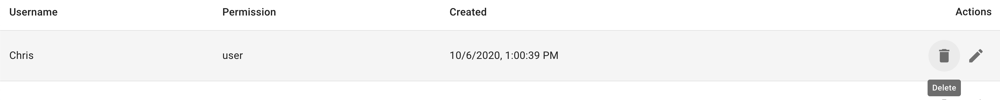

# User Management

First select `Users`:

{ .shadow}

## Add a User

Click `ADD +` button in the top right of the users overview page. This will
navigate you to the `User Details` form.

{ .shadow}

From here you can enter the new user's details and choose their access
level from the dropdown.

## Edit a User

On the row for the user you would like to edit, click the pencil icon in
the `Actions` column.

{ .shadow}

This will navigate you back to the `User Details` form, this time
with the user name locked but the rest of the options available
to change. Make the desired changes and click `SAVE`

{ .shadow}

## Delete a User

On the row for the user you would like to delete, click the trash can icon in
the `Actions` column.

{ .shadow}

This will prompt you to *confirm* that you do want to delete the selected user.
Be sure you want to delete the user as this action is not reversable.

{ .shadow}

## An explanation of different role based access for Cluster Routes

|userName|USER_TYPE|read|update|delete|
|:-:|:-:|:-:|:-:|:-:|
|Chris|user|FALSE|FALSE|FALSE|
| Joseph|user|TRUE|FALSE|FALSE|
|Ryan|user|TRUE|FALSE|FALSE|
|Jimmy|admin|TRUE|TRUE|FALSE|
|Ivo|admin|TRUE|TRUE|FALSE|
|Mikaela|admin|TRUE|TRUE|FALSE|
|Alex|superuser|TRUE|TRUE|TRUE|

**Chris** is a basic user with no permissions on any resourcess. He cannot
 see the user tab.

**Joseph** is a basic user with read permissions on a specific resource.
He may see information about users permissioned on the specified resource.

**Ryan** is a basic user with write permissions on a specific resource. He may see
and update information about the users permissioned on the specified resource.

**Jimmy** is an admin user with no permisions on any resource. He may add
and update user information.

**Ivo** is an admin user with read permissions on a specific resource. He
may add and update user information.

**Mikaela** is an admin user with write permissions on a specific resource.
She may add and update user information.

**Alex** is a superuser. He may take any action on all users. He may delete
users.
